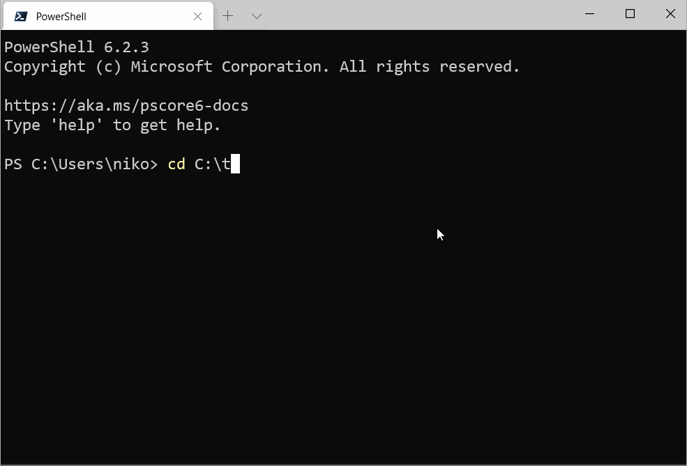

Powershell add-on to automatically activate/deactivate python virtual environments created with [venvlink](https://github.com/np-8/venvlink).


# What is it?

The [venvlink](https://github.com/np-8/venvlink) creates a folder called `venv`  into the root of the project directory. This folder contains `venvlink-autoenv.ps1` and `venvlink-autoenv.leave.ps1` files which can be automatically called by `venvlink-autoenv` to activate / deactivate the linked virtual environment.

## Features
- When you enter a project folder (including subdirectories) which has virtual environment link created with [venvlink](https://github.com/np-8/venvlink),  the virtual environment will be **automatically activated**. 
- When you leave the project folder, the virtual environment is **automatically deactivated**.
- For security reasons, before automatically running the activation/deactivation scripts, `venvlink-autoenv` asks for authorization of the script. It stores the full file path and the MD5 hash of the file contents to a file (`~/venvlink-autoenv-auth`). *This is done only the first time for each file.*


# Installing

## Option 1
Run the following command in the Powershell to download the package from [PowerShell Gallery](https://www.powershellgallery.com/packages/venvlink-autoenv):
```
Install-Module venvlink-autoenv
```

Then, run 
```
Add-Content $PROFILE @("`n", "import-module venvlink-autoenv")
```
to make the `venvlink-autoenv` available in every Powershell session you start. (or edit the `$profile` file manually)

**Note**: If you use many versions of Powershell (Powershell 5.1, Powershell 6, Powershell 7), you might need to install the `venvlink-autovenv` to each of the separately. 

## Option 2
Just download the `venvlink-autoenv\venvlink-autoenv.psm1` and place it anywhere on your computer. Then, check the profile.ps1 location with `$PROFILE`. It can be something like

```
C:\Users\user\OneDrive\Documents\PowerShell\Microsoft.PowerShell_profile.ps1
```
This is the file that is loaded at the startup of your Powershell. Add there a line

```
Import-Module '<path_to_venvlink-autoenv.psm1>'
```

# Usage

After installation, just use Powershell to locate into any folder with virtual environment created with venvlink.


# Credits

- venvlink-autovenv was built on top of [ps-autoenv](https://github.com/nickcox/ps-autoenv) by [Nick Cox](https://github.com/nickcox).